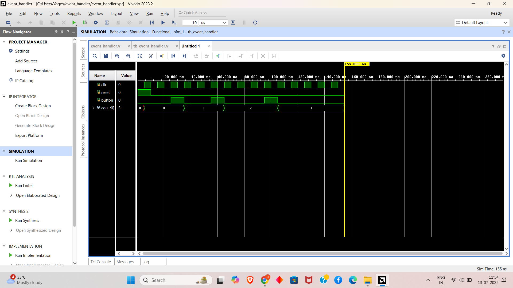
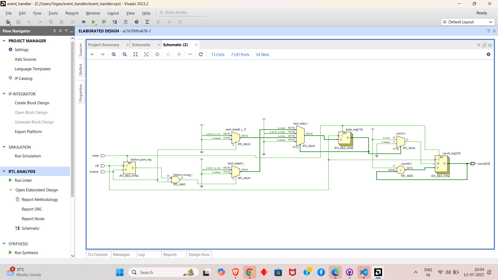

# fsm-event-handler
A Verilog-based FSM design that detects button press events using rising-edge detection and counts them using a clock-synchronized counter.

# 🔁 Sequential Logic – FSM Event Handler & Edge-Triggered Counter

This project is part of the **FPGA Prototyping and Verilog Internship**, focusing on designing clean, clock-driven FSMs and reliable edge-triggered event handlers used in embedded control systems.

It includes:

- ✅ A finite state machine (FSM) that handles input events
- ✅ Edge detection logic to count clean button presses
- ✅ Synchronous reset and testbench simulation

> Designed and simulated using **Verilog HDL** in **Vivado 2023.2**.

---

## 📁 Project Structure

```
├── event_handler.v             # RTL: FSM with button edge detection & counter
├── tb_event_handler.v          # Testbench for simulation
├── README.md                   # Project documentation
```

---

## 🔧 Tools Used

- **Language:** Verilog HDL  
- **Simulator:** Vivado 2023.2 Behavioral Simulation  
- **Target Hardware:** FPGA-Compatible RTL (clocked logic)

---

## ✅ FSM-Based Event Handler

### 🔍 Description

This module detects **rising edges** on a debounced button input and **increments a counter** using a 3-state FSM.

### 🧠 FSM States

| State | Description                  |
|-------|------------------------------|
| IDLE  | Waiting for button press     |
| COUNT | Button just pressed, count++ |
| WAIT  | Wait for button release      |

### 🔁 FSM Diagram

```
      +-------+
      | IDLE  |
      +---+---+
          |
       button rising edge
          v
      +-------+
      | COUNT |
      +---+---+
          |
          v
      +-------+
      | WAIT  |
      +---+---+
          |
      button = 0
          |
          v
      +-------+
      | IDLE  |
      +-------+
```

---

## 📊 Example Behavior

| Time (ns) | Button | Counter |
|-----------|--------|---------|
| 0         | 0      | 0       |
| 20        | 1↑     | 1       |
| 40        | 1↑     | 2       |
| 70        | 1↑     | 3       |

> Button ↑ = rising edge detected

---

## 🖥️ Sample Waveform



---


---

## 🖥️ Sample Waveform



---

## 📌 Features

- FSM handles edge-triggered button input
- Counter increments only on clean button press
- Synchronous reset for consistent behavior
- Debounce-ready input logic
- Clean RTL design with simulation testbench

---

## 🚀 How to Simulate (Vivado)

1. Open Vivado → New Project → Add `event_handler.v` and `tb_event_handler.v`
2. Run Behavioral Simulation
3. View waveforms for state and counter transitions

---

## 🔗 Submission

- [✔️ GitHub Repository](https://github.com/your-username/fpga-fsm-event-handler) *(Update with your repo link)*
- Add waveform screenshot in `/screenshots/`
- Submit the GitHub repo link via the internship form

---

## 🙌 Acknowledgment

Task assigned by **Prism Studio Internship Team** under the Verilog sequential logic series.  
Focus was on edge-triggered state machines, event counters, and hardware-synthesis readiness.

---